# Coronavirus_Tweets
Natural Language Processing and Sentiment Analysis project for tag all the coronavirus tweets.

The objective of this project was to apply all the NLP and Sentiment analysis knowledge that I learn with my coursera courses in the 2020 Coronavirus Pandemic, also this project helped me develope a Sentiment Analysis program to participate in the 2020 BBVA Hackathon (another project in this github).

The project has an Exploratory Data Analysis part and three diferent models with many changes.

Exploratory Data Analysis

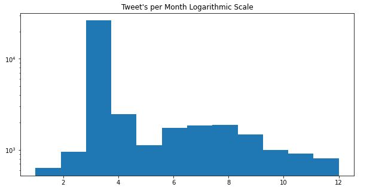

The number of tweets in march is so much larger than any other month, this is caused because in frebruary 29th the first person died of Coronavirus in the USA.

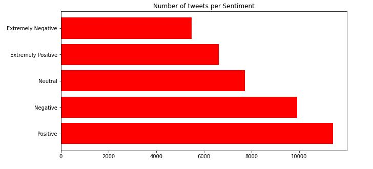

The chart shows that most of the tweets are positive. This may be correct, and english speakers have good sentiments with the pandemic, or there is bias in the tweet selection.

## Models

### Model 1

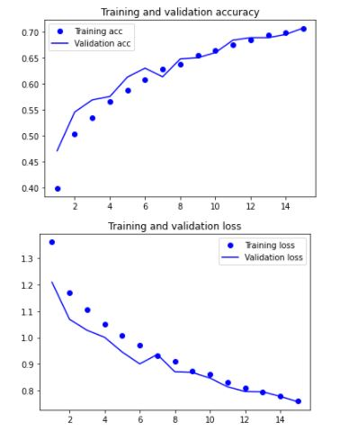

In this model we can apreciate almost no overfitting, with 70% of accuracy, this model just has and embedding layer and two recurrent layers, in the next model the preprocessing and the acurracy increases, also there are five categories tha may be confused.

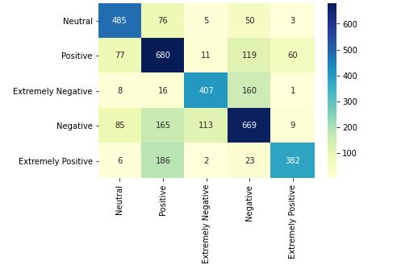

As expected, the extremely positives tweets are confused with the positive tweets, this also occurs with the negative tweets. The next part will be joining this four categories into only two, this may help in the accuracy metric.

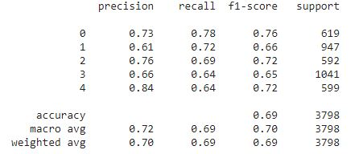

As we can see the f1 score decreases in the Positive and Negative categories, probably these categories are confused with the Extremely Positive and Extreme Negative categories respectively.

### Model 2

The next model just reduces the number of categories of the tweets. The Extremely Negative and Positive categories are added to the Negative and Positive catgories respectively, and the Neutral category stays at it is.

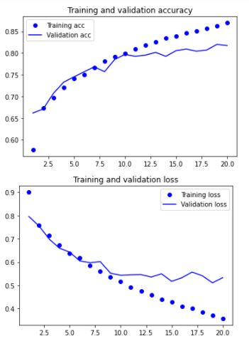

There is an increment in the categorical acurracy for train and validation set, also a increase is observed in the overfitting of the new model.

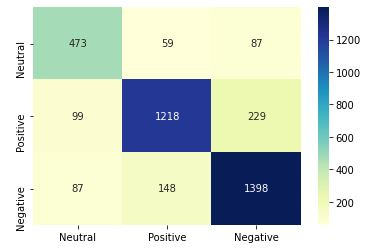

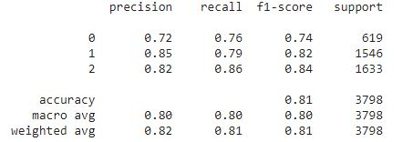

The f1 score and acuracy increase with this model, beacuse of the decrease of categories, there is no confussion with the categories, but as we can see there is as significant decrease in the f1 score of the neutral category, so in the next model this will be eliminated.

### Model 3

This final model add the Extremely Negative and Positive categories as the model before, but it also eliminates the Neutral category. In the same way, there is a deeper text cleansing(standardize and eliminate stopwords) apply to the data set.

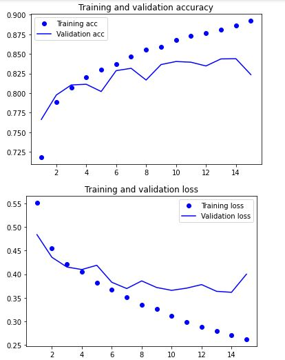

We can see an increase in the accuracy of this model, but and increase in the overfitting

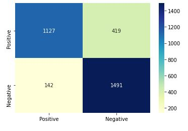

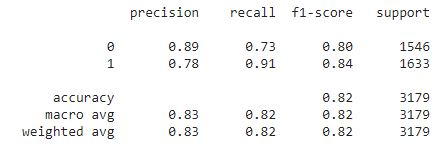

All metrics increase with this model, this is thanks to the standardize and elimination of stopwords. This model may be better with an architecture change or an increase in the dataset.

Hope you like my project, thanks for reading.

Edgar Cardoso
